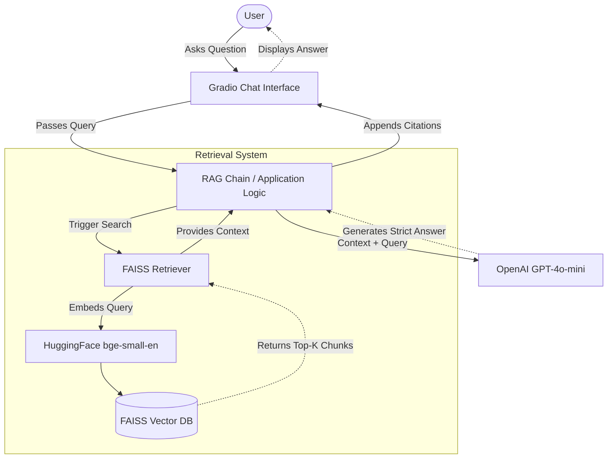
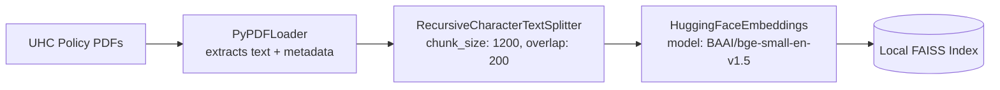

# 🏢 UHC Insurance Policy Chatbot

An AI-powered RAG (Retrieval-Augmented Generation) Chatbot designed to help doctors, hospital staff, and users understand and query [UnitedHealthcare (UHC)](https://www.uhc.com/) insurance policies easily.

## 🌟 Overview

The UHC Insurance Policy Chatbot uses state-of-the-art NLP models and a FAISS vector database to provide accurate, context-aware answers based strictly on provided UHC policy documents. 

Key features include:
- **PDF Ingestion & Processing**: Automatically loads, chunks, and indexes UHC policy PDFs.
- **Accurate Retrieval**: Uses HuggingFace embeddings (`BAAI/bge-small-en-v1.5`) and FAISS for efficient semantic search and MMR (Maximal Marginal Relevance) to fetch the most relevant context.
- **LLM Integration**: Responses are generated using OpenAI's `gpt-4o-mini` model, ensuring that answers are derived only from the provided context. If an answer isn't in the documents, the bot clearly states so.
- **Citations**: The bot provides page-level citations for every answer, ensuring traceability and trust.
- **Conversational UI**: A sleek, user-friendly interface built with [Gradio ChatInterface](https://www.gradio.app/).

## � Architecture & Design

### High-Level Design (HLD)

The chatbot is built using a classic Retrieval-Augmented Generation (RAG) architecture. It connects a user-friendly frontend to an LLM, heavily grounded by a local vector database to prevent hallucinations and enforce policy-based answers.



### Low-Level Design (LLD)

The internal processes are divided into **Data Ingestion** and **Retrieval & Generation**.

**Data Ingestion Pipeline:**


**Retrieval & Generation Flow Details:**
1. **Query Processing**: The user's query may be pre-processed to represent a suitable search string.
2. **Search Strategy**: The FAISS Retriever uses **Maximal Marginal Relevance (MMR)** (`fetch_k=20`, `k=6`) to ensure that the retrieved context is both highly relevant and diverse, reducing redundant information.
3. **Context Formatting**: Pulled chunks are concatenated with their source policy name and page numbers, capped at 12,000 characters to fit within the LLM context window efficiently.
4. **Constrained Generation**: ChatGPT (gpt-4o-mini, temperature=0) is prompted precisely to only use the provided context. If the answer is missing, it returns a standard fallback response.
5. **Citation Injection**: Source metadata from the retrieved chunks is appended as a formatted citation list at the end of the final response.

## �📁 Project Structure

```bash
📦 chatbot
 ┣ 📂 chatbot        # Contains the core RAG logic (LLM + Context)
 ┃ ┗ 📜 rag_chain.py
 ┣ 📂 data           # Directory for raw UHC policy PDFs
 ┣ 📂 ingestion      # Data processing pipeline
 ┃ ┣ 📜 chunker.py   # Splits documents into smaller chunks
 ┃ ┣ 📜 embedder.py  # Generates embeddings and builds the FAISS index
 ┃ ┗ 📜 loader.py    # Loads PDF documents using PyPDFLoader
 ┣ 📂 retrieval      # Search functionalities
 ┃ ┗ 📜 vectorstore.py # Loads the FAISS index and retrieves relevant documents
 ┣ 📂 scripts        # Utility scripts for downloading and extracting data
 ┣ 📂 storage        # Pickled chunk data
 ┣ 📂 vectorstore    # FAISS local index storage
 ┣ 📜 app.py         # The Gradio web interface application
 ┗ 📜 requirements.txt # Project dependencies
```

## 🚀 Getting Started

### Prerequisites

- Python 3.9+
- An OpenAI API Key

### Installation

1. **Clone the repository:**
   ```bash
   git clone <repository_url>
   cd <repository_folder>
   ```

2. **Create and activate a virtual environment (recommended):**
   ```bash
   python -m venv venv
   # On Windows:
   .\venv\Scripts\Activate.ps1
   # On macOS/Linux:
   source venv/bin/activate
   ```

3. **Install dependencies:**
   ```bash
   pip install -r requirements.txt
   ```

4. **Environment Variables:**
   Create a `.env` file in the root directory and add your OpenAI API key:
   ```env
   OPENAI_API_KEY=your_openai_api_key_here
   ```

### 🔨 Building the Vector Database

Before running the chatbot, you need to process your PDFs and build the FAISS vector store.

1. **Place your UHC policy PDFs** in the `data/uhc_policies/` folder.
2. **Chunk the documents:**
   ```bash
   python ingestion/chunker.py
   ```
3. **Build the FAISS index:**
   ```bash
   python ingestion/embedder.py
   ```

### 💬 Running the Chatbot

Start the Gradio web interface:

```bash
python app.py
```

Open the provided local URL (usually `http://127.0.0.1:7860/` or `http://0.0.0.0:7860/`) in your browser to start chatting!

## ⚙️ How it Works

1. **Loading**: `loader.py` reads PDFs from the `data/` folder and extracts text.
2. **Chunking**: `chunker.py` uses LangChain's `RecursiveCharacterTextSplitter` to break the text into 1200-character chunks with a 200-character overlap for context retention.
3. **Embedding**: `embedder.py` uses `BAAI/bge-small-en-v1.5` (via CPU) to embed the chunks and stores them locally using FAISS.
4. **Retrieval**: `vectorstore.py` loads the FAISS index and fetches the top relevant documents using Maximal Marginal Relevance (MMR).
5. **Generation**: `rag_chain.py` constructs a prompt with the retrieved context and user query, asking `gpt-4o-mini` to provide a precise answer with citations.

---

*Note: Ensure you have sufficient permissions and rights to use and process the specific UHC policy documents you download.*
